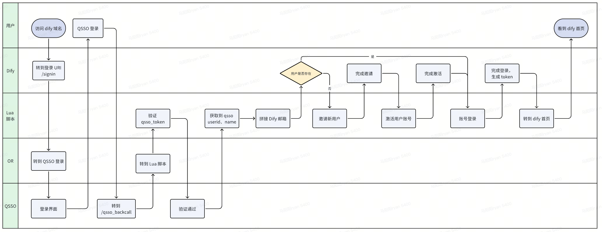

# Dify QSSO Bridge

> 🔐 A non-invasive SSO integration solution for Dify using OpenResty, enabling enterprise single sign-on without modifying Dify source code

English | [简体中文](README.zh-CN.md)

## 📖 Overview

`dify-qsso-bridge` is a universal SSO bridge solution for Dify that implements gateway-level authentication interception and token mapping through OpenResty (Nginx + Lua), eliminating the need to modify Dify's source code for enterprise SSO integration.

While this solution uses QSSO as an example, the architecture is designed to be universal and can be easily adapted to other SSO systems (CAS, OAuth2, SAML, etc.).

## ✨ Key Features

- 🚀 **Non-invasive Design** - No modifications to Dify source code, easy to maintain and upgrade
- 🔒 **Secure & Reliable** - Token exchange with expiration, complete authentication flow
- 🎯 **Gateway-level Interception** - Authentication logic handled at OpenResty layer with minimal overhead
- 🔧 **Extensible** - Clear architecture design, quick adaptation to other SSO systems
- 📝 **Complete Logging** - Trace ID throughout the entire flow for easy troubleshooting

## 🏗️ Architecture

### Solution Comparison

| Solution | Description | Pros & Cons | Chosen |
|----------|-------------|-------------|--------|
| **Modify Dify Code** | Modify dify-web and dify-api source code for SSO mapping | ❌ High maintenance cost on version upgrades | ❌ |
| **Gateway + Lua** | Use OpenResty to intercept and handle authentication at gateway layer | ✅ Non-invasive, maintainable, extensible | ✅ |

### Authentication Flow



**Flow Details:**

1. User accesses Dify, gets redirected to `/signin` when token expires
2. OpenResty intercepts `/signin`, redirects to QSSO login page (with callback URL)
3. QSSO authenticates user and calls back to `/qsso_backcall` (with QSSO token)
4. Lua script intercepts `/qsso_backcall`, extracts QSSO token and calls Dify Management Service
5. Dify Management Service validates QSSO token, creates/retrieves Dify user, returns Dify tokens
6. OpenResty redirects to Dify homepage with tokens, completing the login

## 🚀 Quick Start

### Prerequisites

- Deployed Dify instance
- SSO authentication system (e.g., QSSO)
- Dify Management Service (for token mapping)

### Installation Steps

#### 1. Build OpenResty Image

The official `openresty/openresty:alpine-fat` image doesn't include the `lua-resty-http` module. Build a custom image:

```dockerfile
# Dockerfile
FROM openresty/openresty:alpine-fat
RUN luarocks install lua-resty-http
RUN luarocks install lua-resty-openssl
```

```bash
# Build the image (replace with your own registry)
docker build -t your-registry/openresty:alpine-fat .
```

#### 2. Configure Environment Variables

Set the following environment variables in your deployment:

```env
# Dify Management Service API endpoint for token exchange
DIFY_TOKEN_BY_QSSO_API_BASE_URL=http://api.internal:8087/get_dify_token

# Dify homepage URL (redirect destination after successful login)
DIFY_HOME_PAGE_BASE_URL=http://dify.yourdomain.com/apps

# QSSO login page URL (including callback URL parameter)
QSSO_LOGIN_URL=https://qsso.yourdomain.com/login.php?ret=http%3A%2F%2Fdify.yourdomain.com%2Fqsso_backcall

# Nginx configuration
NGINX_PORT=80
NGINX_SERVER_NAME=localhost
```

⚠️ **Note:** Replace `yourdomain.com` with your actual domain

#### 3. Configure OpenResty

Add the following configuration to your `nginx.conf`:

```nginx
# Declare environment variables (make them accessible to Lua)
env DIFY_TOKEN_BY_QSSO_API_BASE_URL;
env DIFY_HOME_PAGE_BASE_URL;

http {
    # Docker internal DNS resolution
    resolver 127.0.0.11 valid=30s;
    
    # Other configurations...
}
```

The site configuration is provided in `nginx/conf.d/default.conf.template`:

```nginx
server {
    listen ${NGINX_PORT};
    server_name ${NGINX_SERVER_NAME};

    # QSSO callback handler - processes SSO authentication response
    location = /qsso_backcall {
      content_by_lua_file /usr/local/openresty/nginx/lua/qsso_backcall.lua;
    }

    # Login interceptor - redirects to QSSO login page
    location = /signin {
        return 302 ${QSSO_LOGIN_URL};
    }

    # Add your other Dify proxy configurations below
}
```

#### 4. Deploy Lua Script

Place the `qsso_backcall.lua` script in the `nginx/lua/` directory. The script is included in this repository and handles the token exchange logic.

## ⚙️ Configuration

### Environment Variables

| Variable | Description | Example |
|----------|-------------|---------|
| `DIFY_TOKEN_BY_QSSO_API_BASE_URL` | Dify Management Service endpoint for token exchange | `http://api.internal:8087/get_dify_token` |
| `DIFY_HOME_PAGE_BASE_URL` | Dify homepage URL, redirect destination after login | `http://dify.yourdomain.com/apps` |
| `QSSO_LOGIN_URL` | SSO login page URL with callback parameter | `https://sso.yourdomain.com/login?ret=...` |

### Dify Management Service API Specification

The Dify Management Service must provide the following API endpoint:

**Request:**
```http
GET /get_dify_token?trace_id={trace_id}&token={qsso_token}
```

**Response:**
```json
{
  "access_token": "eyJhbGciOiJIUzI1NiIsInR5cCI6IkpXVCJ9...",
  "refresh_token": "eyJhbGciOiJIUzI1NiIsInR5cCI6IkpXVCJ9..."
}
```

**Business Logic:**

1. Validate QSSO token authenticity
2. Query Dify's `account` and `tenant_account` tables
3. Handle different scenarios:
   - **New user**: Create account and add to default tenant
   - **Existing user without tenant**: Re-add to default tenant
   - **Existing user with tenant**: Return tokens directly
4. Call Dify API to generate and return tokens

**Related Dify Database Tables:**
- `account` - User account table
- `tenant_account` - Tenant-user relationship table

## 🔒 Security

### Token Security Mechanisms

1. **QSSO Token Expiration**
   - QSSO tokens are invalidated immediately after validation, preventing reuse even if intercepted

2. **Invitation Token Protection**
   - Email invitation tokens have expiration time
   - Only first activation is valid, subsequent attempts fail

3. **Login Token Protection**
   - Access tokens and refresh tokens have expiration times
   - Follows Dify's native token refresh mechanism

### Known Security Considerations

⚠️ The following risks are inherited from Dify's original design, not introduced by this solution:

1. **Plain Text Transmission**: Account activation and login APIs use POST body in plain text (recommend HTTPS in production)
2. **Token Interception**: Login success returns tokens in URL which could be intercepted (recommend short expiration periods)

## 🐛 Troubleshooting

### 1. OpenResty Image Startup Failed

**Cause:** Nginx and OpenResty have different configuration file paths

**Solution:** Check and modify the volume mount paths in your container configuration:

```yaml
volumes:
  - ./nginx/nginx.conf:/usr/local/openresty/nginx/conf/nginx.conf
  - ./nginx/conf.d:/usr/local/openresty/nginx/conf/conf.d
  - ./nginx/lua:/usr/local/openresty/nginx/lua
```

### 2. Lua Script Cannot Find `resty.http` Module

**Cause:** Official image doesn't include this module

**Solution:** Build the custom image using the provided Dockerfile

### 3. Infinite Redirect Loop After QSSO Authentication

**Cause:** Lua script returns invalid tokens, causing login failure

**Solution:** 
- Check if Dify Management Service API is working properly
- Check OpenResty logs (trace by Trace ID):
  ```bash
  docker logs -f <nginx_container_id> | grep "TRACE_ID"
  ```

### 4. Lua Logs Not Showing

**Cause:** Nginx default log level is `notice`, Lua's `ngx.log` requires `warn` level

**Solution:** Set in `nginx.conf`:

```nginx
error_log /dev/stderr warn;
```

### 5. Lua Cannot Read Environment Variables

**Cause:** Nginx worker processes don't inherit all environment variables by default

**Solution:** Explicitly declare in `nginx.conf`:

```nginx
env DIFY_TOKEN_BY_QSSO_API_BASE_URL;
env DIFY_HOME_PAGE_BASE_URL;
```

### 6. Lua Cannot Request External URLs

**Cause:** Docker container lacks DNS resolution configuration

**Solution:** Add to `http` block in `nginx.conf`:

```nginx
resolver 127.0.0.11 valid=30s;
```

### 7. Token Expiration Mismatch

- **Dify expires first**: Automatically redirects to `/signin`, intercepted for QSSO re-login ✅ No action needed
- **QSSO expires first**: Wait for Dify token expiration for automatic re-login ✅ No action needed

### 8. Logout Button Not Working

**Current Behavior:** After logout, Dify token is invalidated, immediately redirects to QSSO for re-login

**Temporary Solution:** Need to implement simultaneous QSSO logout (this functionality should be implemented in Dify Management Service)

## 🔧 Adapting to Other SSO Systems

This solution is designed to be universal. Adapting to other SSO systems requires modifying the following:

### 1. Modify Environment Variables

Replace `QSSO_LOGIN_URL` with your target SSO login URL:

```env
# CAS example
SSO_LOGIN_URL=https://cas.yourdomain.com/login?service=http%3A%2F%2Fdify.yourdomain.com%2Fsso_callback

# OAuth2 example
SSO_LOGIN_URL=https://oauth.yourdomain.com/authorize?client_id=xxx&redirect_uri=http%3A%2F%2Fdify.yourdomain.com%2Fsso_callback
```

### 2. Modify Callback Route

Update the route name in `default.conf.template`:

```nginx
location = /sso_callback {
    content_by_lua_file /usr/local/openresty/nginx/lua/sso_callback.lua;
}
```

### 3. Modify Lua Script

Adjust `sso_callback.lua` based on your SSO's token delivery method:

```lua
-- CAS typically passes ticket via URL parameter
local ticket = ngx.var.arg_ticket

-- OAuth2 typically passes code via URL parameter
local code = ngx.var.arg_code
```

### 4. Adjust Management Service

Modify Dify Management Service to support your target SSO's token validation logic.

## 📂 Project Structure

```
dify-qsso-bridge/
├── README.md                           # English documentation (this document)
├── README.zh-CN.md                     # Chinese documentation
├── LICENSE                             # MIT License
├── .gitignore                          # Git ignore configuration
├── Dockerfile                          # OpenResty image build file
├── images/                              # Architecture diagrams and other image resources
└── nginx/
    ├── conf.d/
    │   └── default.conf.template       # Site configuration template
    └── lua/
        └── qsso_backcall.lua          # QSSO callback handler script
```

## 🤝 Contributing

Issues and Pull Requests are welcome!

### Contribution Workflow

1. Fork this repository
2. Create a feature branch: `git checkout -b feature/your-feature`
3. Commit your changes: `git commit -am 'Add some feature'`
4. Push to the branch: `git push origin feature/your-feature`
5. Submit a Pull Request

### Code Standards

- Lua scripts follow [Lua Style Guide](https://github.com/luarocks/lua-style-guide)
- Nginx configurations follow official best practices
- Commit messages follow [Conventional Commits](https://www.conventionalcommits.org/)

## 📄 License

This project is licensed under the [MIT License](LICENSE).

## 🙏 Acknowledgments

- [Dify](https://github.com/langgenius/dify) - Excellent LLMOps platform
- [OpenResty](https://openresty.org/) - Powerful web application server
- All contributors and users

---

⭐ If this project helps you, please star it!
