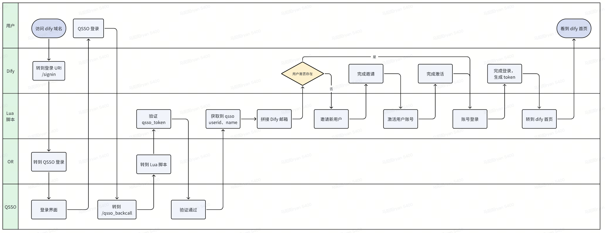

# Dify QSSO Bridge

> 🔐 基于 OpenResty 的 Dify SSO 登录桥接方案，实现非侵入式的企业级单点登录集成

[English](README.md) | 简体中文

## 📖 项目简介

`dify-qsso-bridge` 是一个通用的 Dify SSO 登录解决方案，通过 OpenResty（Nginx + Lua）实现网关层的登录拦截和 Token 映射，无需修改 Dify 源代码即可接入企业内部的 SSO 认证系统。

本方案以 QSSO 为例，但架构设计具有通用性，可轻松适配其他 SSO 系统（如 CAS、OAuth2、SAML 等）。

## ✨ 核心特性

- 🚀 **非侵入式设计** - 无需修改 Dify 源代码，便于版本升级维护
- 🔒 **安全可靠** - Token 传递具有时效性，支持完整的认证流程
- 🎯 **网关层拦截** - 在 OpenResty 层面处理登录逻辑，性能开销小
- 🔧 **易于扩展** - 清晰的架构设计，可快速适配其他 SSO 系统
- 📝 **完整日志** - Trace ID 贯穿全流程，便于问题排查

## 🏗️ 架构设计

### 方案对比

| 方案 | 描述 | 优劣势 | 选型 |
|------|------|--------|------|
| **修改 Dify 代码** | 修改 dify-web 和 dify-api 源码实现 SSO 映射 | ❌ 版本升级维护成本高 | ❌ |
| **网关 + Lua** | 使用 OpenResty 在网关层拦截和处理登录 | ✅ 非侵入、易维护、可扩展 | ✅ |

### 认证流程



**流程说明：**

1. 用户访问 Dify，Token 过期后重定向到 `/signin`
2. OpenResty 拦截 `/signin`，重定向到 QSSO 登录页（带回调地址）
3. QSSO 认证成功后，回调到 `/qsso_backcall`（携带 QSSO Token）
4. Lua 脚本拦截 `/qsso_backcall`，提取 QSSO Token 并调用 Dify 管理服务
5. Dify 管理服务验证 QSSO Token，创建/获取 Dify 用户，返回 Dify Token
6. OpenResty 重定向到 Dify 首页，完成登录

## 🚀 快速开始

### 前置要求

- 已部署的 Dify 实例
- SSO 认证系统（如 QSSO）
- Dify 管理服务（用于 Token 映射）

### 安装步骤

#### 1. 构建 OpenResty 镜像

官方 `openresty/openresty:alpine-fat` 镜像不包含 `lua-resty-http` 模块，需要自行构建：

```dockerfile
# Dockerfile
FROM openresty/openresty:alpine-fat
RUN luarocks install lua-resty-http
RUN luarocks install lua-resty-openssl
```

```bash
# 构建镜像（建议替换为你自己的镜像仓库地址）
docker build -t your-registry/openresty:alpine-fat .
```

#### 2. 配置环境变量

在你的部署环境中设置以下环境变量：

```env
# Dify 管理服务 API 地址（用于获取 Dify Token）
DIFY_TOKEN_BY_QSSO_API_BASE_URL=http://api.internal:8087/get_dify_token

# Dify 首页地址（登录成功后跳转）
DIFY_HOME_PAGE_BASE_URL=http://dify.yourdomain.com/apps

# QSSO 登录页地址（包含回调地址参数）
QSSO_LOGIN_URL=https://qsso.yourdomain.com/login.php?ret=http%3A%2F%2Fdify.yourdomain.com%2Fqsso_backcall

# Nginx 配置
NGINX_PORT=80
NGINX_SERVER_NAME=localhost
```

⚠️ **注意：** 请将 `yourdomain.com` 替换为实际的域名

#### 3. 配置 OpenResty

在 `nginx.conf` 中添加以下配置：

```nginx
# 声明环境变量（让 Lua 可以访问）
env DIFY_TOKEN_BY_QSSO_API_BASE_URL;
env DIFY_HOME_PAGE_BASE_URL;

http {
    # Docker 内网 DNS 解析
    resolver 127.0.0.11 valid=30s;
    
    # 其他配置...
}
```

站点配置已在 `nginx/conf.d/default.conf.template` 中提供：

```nginx
server {
    listen ${NGINX_PORT};
    server_name ${NGINX_SERVER_NAME};

    # QSSO 回调处理器 - 处理 SSO 认证响应
    location = /qsso_backcall {
      content_by_lua_file /usr/local/openresty/nginx/lua/qsso_backcall.lua;
    }

    # 登录拦截器 - 重定向到 QSSO 登录页
    location = /signin {
        return 302 ${QSSO_LOGIN_URL};
    }

    # 在下方添加其他 Dify 代理配置
}
```

#### 4. 部署 Lua 脚本

将 `qsso_backcall.lua` 脚本放置在 `nginx/lua/` 目录下。该脚本已包含在仓库中，负责处理 Token 交换逻辑。

## ⚙️ 配置说明

### 环境变量详解

| 变量名 | 说明 | 示例 |
|--------|------|------|
| `DIFY_TOKEN_BY_QSSO_API_BASE_URL` | Dify 管理服务获取 Token 的 API 地址 | `http://api.internal:8087/get_dify_token` |
| `DIFY_HOME_PAGE_BASE_URL` | Dify 首页地址，登录成功后跳转 | `http://dify.yourdomain.com/apps` |
| `QSSO_LOGIN_URL` | SSO 登录页地址，需包含回调参数 | `https://sso.yourdomain.com/login?ret=...` |

### Dify 管理服务 API 规范

Dify 管理服务需要提供以下接口：

**请求：**
```http
GET /get_dify_token?trace_id={trace_id}&token={qsso_token}
```

**响应：**
```json
{
  "access_token": "eyJhbGciOiJIUzI1NiIsInR5cCI6IkpXVCJ9...",
  "refresh_token": "eyJhbGciOiJIUzI1NiIsInR5cCI6IkpXVCJ9..."
}
```

**业务逻辑：**

1. 验证 QSSO Token 的有效性
2. 查询 Dify 的 `account` 和 `tenant_account` 表
3. 根据场景处理：
   - **新用户**：创建账号并加入默认租户
   - **已存在用户无租户**：重新加入默认租户
   - **已存在用户有租户**：直接返回 Token
4. 调用 Dify API 生成并返回 Token

**涉及的 Dify 数据表：**
- `account` - 用户账号表
- `tenant_account` - 租户与用户关联表

## 🔒 安全性说明

### Token 安全机制

1. **QSSO Token 时效性**
   - QSSO Token 验证后立即失效，即使被拦截也无法复用

2. **邀请 Token 保护**
   - 邮件邀请返回的 Token 具有时效性
   - 只有首次激活有效，重复激活会失败

3. **登录 Token 保护**
   - Access Token 和 Refresh Token 具有过期时间
   - 遵循 Dify 原有的 Token 刷新机制

### 已知安全风险

⚠️ 以下风险继承自 Dify 原有设计，非本方案引入：

1. **明文传输风险**：激活账号和登录接口使用 POST Body 明文传输（建议在生产环境启用 HTTPS）
2. **Token 拦截风险**：登录成功返回的 Token 拼接在 URL 中可能被拦截（建议配置短期有效期）

## 🐛 常见问题

### 1. 切换 OpenResty 镜像后启动失败

**原因：** Nginx 和 OpenResty 的配置文件路径不一致

**解决方案：** 检查并修改容器配置中的挂载路径：

```yaml
volumes:
  - ./nginx/nginx.conf:/usr/local/openresty/nginx/conf/nginx.conf
  - ./nginx/conf.d:/usr/local/openresty/nginx/conf/conf.d
  - ./nginx/lua:/usr/local/openresty/nginx/lua
```

### 2. Lua 脚本找不到 `resty.http` 模块

**原因：** 官方镜像未包含该模块

**解决方案：** 使用本项目提供的 Dockerfile 重新构建镜像

### 3. QSSO 认证成功后重复跳转登录

**原因：** Lua 脚本返回无效 Token 导致登录失败

**解决方案：** 
- 检查 Dify 管理服务 API 是否正常
- 查看 OpenResty 日志（通过 Trace ID 追踪）：
  ```bash
  docker logs -f <nginx_container_id> | grep "TRACE_ID"
  ```

### 4. Lua 日志不显示

**原因：** Nginx 默认日志级别为 `notice`，Lua 的 `ngx.log` 需要使用 `warn` 级别

**解决方案：** 在 `nginx.conf` 中设置：

```nginx
error_log /dev/stderr warn;
```

### 5. Lua 无法读取环境变量

**原因：** Nginx 工作进程默认不继承所有环境变量

**解决方案：** 在 `nginx.conf` 顶部显式声明：

```nginx
env DIFY_TOKEN_BY_QSSO_API_BASE_URL;
env DIFY_HOME_PAGE_BASE_URL;
```

### 6. Lua 无法请求外部地址

**原因：** Docker 容器内的 DNS 解析配置缺失

**解决方案：** 在 `nginx.conf` 的 `http` 块中添加：

```nginx
resolver 127.0.0.11 valid=30s;
```

### 7. Token 过期时间不一致

- **Dify 先过期**：自动跳转 `/signin` 被拦截重新登录 QSSO ✅ 无需处理
- **QSSO 先过期**：等待 Dify Token 过期后自动重新登录 ✅ 无需处理

### 8. 登出按钮不生效

**现状：** 登出后 Dify Token 失效，会立即跳转 QSSO 再次登录

**临时方案：** 需要同时登出 QSSO 系统（此功能需在 Dify 管理服务中实现）

## 🔧 适配其他 SSO 系统

本方案设计具有通用性，适配其他 SSO 系统只需修改以下部分：

### 1. 修改环境变量

将 `QSSO_LOGIN_URL` 替换为目标 SSO 的登录地址：

```env
# CAS 示例
SSO_LOGIN_URL=https://cas.yourdomain.com/login?service=http%3A%2F%2Fdify.yourdomain.com%2Fsso_callback

# OAuth2 示例
SSO_LOGIN_URL=https://oauth.yourdomain.com/authorize?client_id=xxx&redirect_uri=http%3A%2F%2Fdify.yourdomain.com%2Fsso_callback
```

### 2. 修改回调路由

在 `default.conf.template` 中修改路由名称：

```nginx
location = /sso_callback {
    content_by_lua_file /usr/local/openresty/nginx/lua/sso_callback.lua;
}
```

### 3. 修改 Lua 脚本

根据目标 SSO 的 Token 传递方式修改 `sso_callback.lua`：

```lua
-- CAS 通常通过 URL 参数传递 ticket
local ticket = ngx.var.arg_ticket

-- OAuth2 通常通过 URL 参数传递 code
local code = ngx.var.arg_code
```

### 4. 调整管理服务

修改 Dify 管理服务以支持目标 SSO 的 Token 验证逻辑。

## 📂 项目结构

```
dify-qsso-bridge/
├── README.md                           # 英文文档
├── README.zh-CN.md                     # 中文文档（本文档）
├── LICENSE                             # MIT 许可证
├── .gitignore                          # Git 忽略配置
├── Dockerfile                          # OpenResty 镜像构建文件
├── images/                              # 架构图等图片资源
└── nginx/
    ├── conf.d/
    │   └── default.conf.template       # 站点配置模板
    └── lua/
        └── qsso_backcall.lua          # QSSO 回调处理脚本
```

## 🤝 贡献指南

欢迎提交 Issue 和 Pull Request！

### 贡献流程

1. Fork 本仓库
2. 创建特性分支：`git checkout -b feature/your-feature`
3. 提交更改：`git commit -am 'Add some feature'`
4. 推送到分支：`git push origin feature/your-feature`
5. 提交 Pull Request

### 代码规范

- Lua 脚本遵循 [Lua Style Guide](https://github.com/luarocks/lua-style-guide)
- Nginx 配置遵循官方最佳实践
- 提交信息遵循 [Conventional Commits](https://www.conventionalcommits.org/)

## 📄 许可证

本项目采用 [MIT License](LICENSE) 开源协议。

## 🙏 致谢

- [Dify](https://github.com/langgenius/dify) - 优秀的 LLMOps 平台
- [OpenResty](https://openresty.org/) - 强大的 Web 应用服务器
- 所有贡献者和使用者

---

⭐ 如果这个项目对你有帮助，欢迎 Star 支持！

